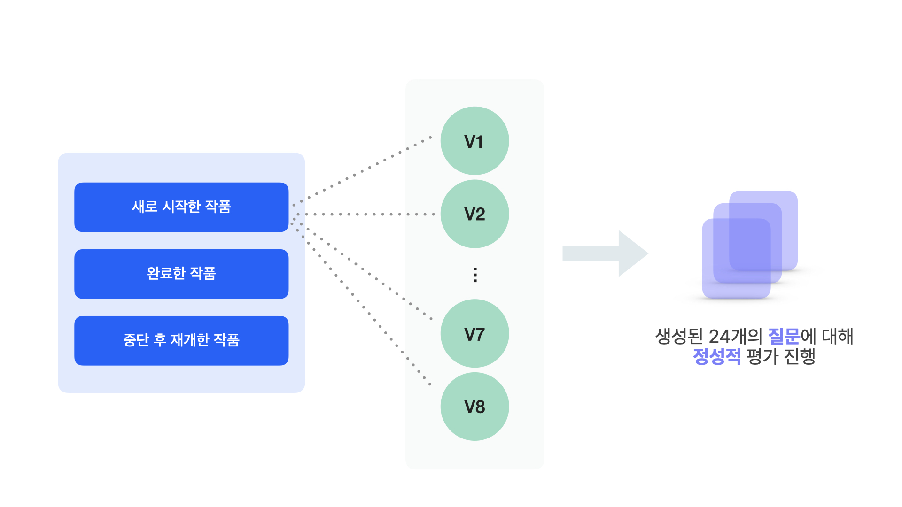
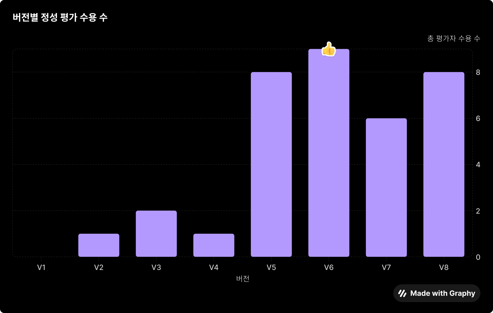
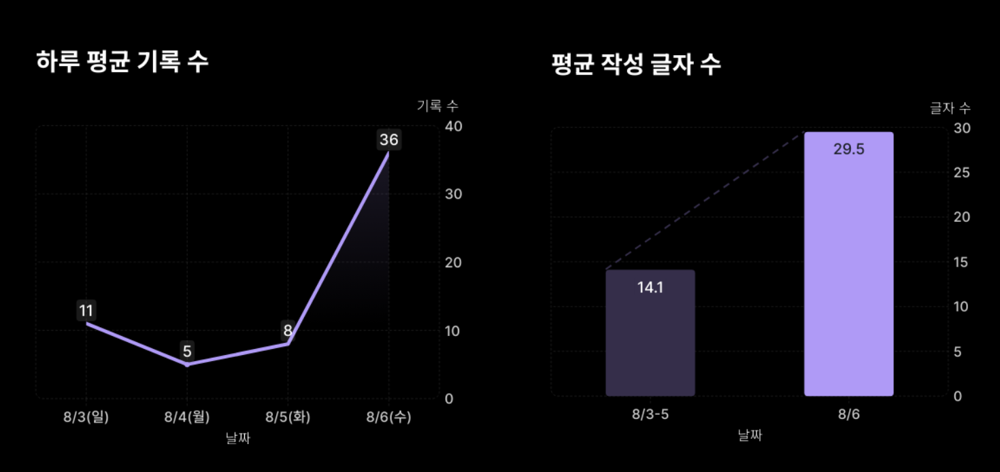
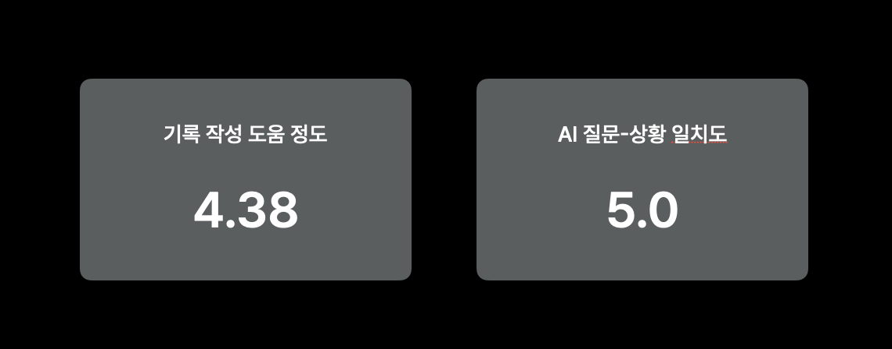

# 기록 유도 AI 실험 보고서

본 실험은 사용자의 작품 진행 상태(유형)에 따라, AI가 적절한 **질문을 생성할 수 있는지**를 평가하기 위해 진행되었습니다.

## 작품 유형 및 목적

| 작품 유형 | 실험 목적 |
| --- | --- |
| **새로 시작한 작품** | AI가 첫 기록을 자연스럽게 유도하는 질문을 생성할 수 있는가 |
| **완료한 작품**  | AI가 마무리 소감 또는 다음 계획을 유도하는 질문을 생성할 수 있는가 |
| **중단 후 재개한 작품** | AI가 과거 맥락을 반영하여 회고적/재진입 유도 질문을 생성할 수 있는가 |

## 질문 유도 AI 버전

| 버전 | 프롬프트 전략 |
| --- | --- |
| **V1** | 기록을 시작하기 쉽게 만드는 **기본 질문 예시 제시** |
| **V2** | 전체 기록 흐름을 분석해 **맥락에 맞는 질문 제공** |
| **V3** | 최근 5개 기록에 집중해 **현재 상황에 맞춘 질문 생성** |
| **V4** | JSON 구조 데이터를 분석해 **구체적인 항목별 질문 생성** |
| **V5** | 프로젝트 진행률에 따라 **적절한 시점에 맞춘 질문 제시** |
| **V6** | 뜨개 단계별 작업 흐름을 반영한 **실행 중심 질문 구성** |
| **V7** | 사용자의 컨디션과 분위기를 고려한 **톤 조절형 질문 생성** |
| **V8** | 감정 상태를 분석하여 **기록 동기를 자극하는 질문 제공** |

---

## 🔄 AI 질문 생성 시스템 프로세스

*AI 질문 생성 시스템: 작품 유형별 입력 → AI 버전별 처리 → 질문 생성 및 정성적 평가*

---
## 버전 별 생성 질문 - 처음 시작한 작품

| 번호 | 질문 내용 |
| --- | --- |
| **V1** | 시작한 지 얼마 안 되었지만, '코 잡기'가 익숙해지셨다면 이제 본격적으로 몸통을 떠나갈 준비가 되셨죠? |
| **V2** | 8월 4일 이후 여름맞이 실버 호보백에 대해 기록이 없었는데, 오늘은 어떤 진전이 있었나요? |
| **V3** | 도안을 보며 실버 호보백 작업을 시작한 지 며칠 지났는데, 오늘은 어떤 부분을 진행 중이신가요? |
| **V4** | 도안을 익히는 데 어려움을 겪으신 것 같은데, 실버 호보백의 다음 단계에서 참고할 부분이 있나요? |
| **V5** | 첫 업데이트네요! 도안 보는 법을 익히고 나서, 다음으로 어떤 준비를 하실 계획인가요? |
| **V6** | 도안 보는 법을 익히는 중이라면, 이번 기록에는 실버 호보백의 시작 단계에서 특히 까다로웠던 부분을 구체적으로 적어보실래요? |
| **V7** | 조금 피곤할 수도 있지만 오늘은 어떤 기분으로 뜨개를 시작하셨나요? |
| **V8** | 도안 보는 법을 익히면서 어떤 부분에 가장 집중하면 좋을지 기록해보면 어떨까요? |

---

## 정성 평가 진행

질문 수: 각 작품 유형별 8개씩, 총 24개  
평가자 수: 3명 × 24문항 = 총 72개 평가

## 서비스 도입 및 결론
정성 평가 결과 점수가 가장 높았던 **V6의 프롬프트**를 최종적으로 **서비스에 도입**하였습니다. 

