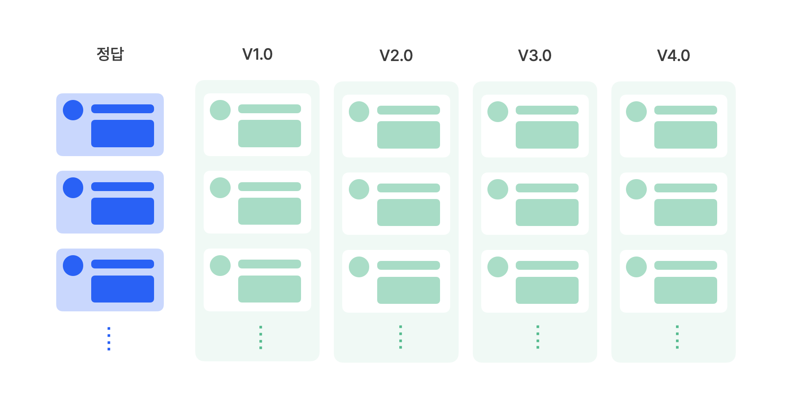
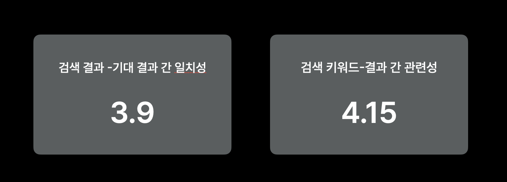

# 🧪 기록 검색 AI 실험 보고서

### 실험 개요

* 검색어: `스웨터`, `가방`, `머플러`
* 기준 데이터: **정답 리스트** (사람이 선정한 이상적인 검색 결과)
* 비교 버전 
  * **V1.0**: 단순 키워드 기반
  * **V2.0**: Embedding 기반
  * **V3.0**: ElasticSearch 기반
  * **V4.0**: Embedding + ElasticSearch 하이브리드 기반

---

### 평가 지표

| 지표                | 설명                                    |
| ----------------- | ------------------------------------- |
| **Recall@10**    | 정답이 검색 상위 10개 안에 얼마나 포함되었는지 (재현율)     |
| **Precision@10** | 검색 상위 10개 중 정답이 얼마나 정확하게 포함되었는지 (정밀도) |
| **F1-score@10**  | Precision과 Recall의 조화 평균              |
| **MRR**           | 정답이 몇 번째에 처음 등장했는지의 역수 평균 (높을수록 좋음)   |
| **평균**            | 위 4개 지표의 단순 평균으로, 종합적인 성능을 나타냄        |

---

### 실험 결과

| 지표            | V1       | V2       | V3       | V4       |
| ------------- | -------- | -------- | -------- | -------- |
| Recall@10    | 0.77     | 0.49     | 0.60     | 0.70     |
| Precision@10 | 0.77     | 0.46     | 0.50     | 0.60     |
| F1-score@10  | 0.77     | 0.47     | 0.54     | 0.64     |
| MRR           | 0.83     | 0.66     | 0.23     | 0.46     |
| **평균**        | **0.78** | **0.52** | **0.47** | **0.60** |

정성 평가 결과 (사용자 만족도 및 지표 평균)

| 평가 항목  | V1   | V2   | V3   | V4       |
| ------ | ---- | ---- | ---- | -------- |
| 평균 만족도 | 2.83 | 1.33 | 3.00 | **3.33** |
| 지표별 평균 | 0.78 | 0.52 | 0.47 | **0.60** |

---

## 서비스 도입 및 결론

정량 지표와 정성 평가를 종합한 결과, **V4.0** 버전이 사용자 만족도와 검색 품질에서 가장 균형 잡힌 성능을 보여주었습니다.

이에 따라, 본 서비스에는 V4.0 버전의 검색 알고리즘을 도입하기로 결정하였습니다.

